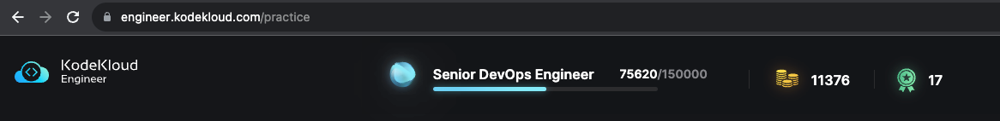

# KodeKloud Engineer

Hi folks 👋

- This repository is my journey at KodeKloud Engineer, my solutions will be updated here.
- I also updated the way to solve Linux problems, instead of doing some boring Linux commands, my solution will solve it
  by leveraging Ansible

## Ranking

- Update 24/09/2023: Promoted to **Senior DevOps Engineer**

# SSH commands

| Service Name             | Command                     |
|--------------------------|-----------------------------|
| Nautilus App 1           | `ssh tony@172.16.238.10`    |
| Nautilus App 2           | `ssh steve@172.16.238.11`   |
| Nautilus App 3           | `ssh banner@172.16.238.12`  |
| Nautilus HTTP LBR        | `ssh loki@172.16.238.14`    |
| Nautilus DB Server       | `ssh peter@172.16.239.10`   |
| Nautilus Storage Server  | `ssh natasha@172.16.238.15` |
| Nautilus Backup Server   | `ssh clint@172.16.238.16`   |
| Nautilus Mail Server     | `ssh groot@172.16.238.17`   |
| Jenkins Server for CI/CD | `ssh jenkins@172.16.238.19` |

# SSH to server with sshpass

`sudo yum install sshpass -y`

| Server Name | Purpose                  | Command                                                                     |
|-------------|--------------------------|-----------------------------------------------------------------------------|
| stapp01     | Nautilus App 1           | `sshpass -p Ir0nM@n ssh -o StrictHostKeyChecking=no tony@172.16.238.10`     |
| stapp02     | Nautilus App 2           | `sshpass -p Am3ric@ ssh -o StrictHostKeyChecking=no steve@172.16.238.11`    |
| stapp03     | Nautilus App 3           | `sshpass -p BigGr33n ssh -o StrictHostKeyChecking=no banner@172.16.238.12`  |
| stlb01      | Nautilus HTTP LBR        | `sshpass -p Mischi3f ssh -o StrictHostKeyChecking=no loki@172.16.238.14`    |
| stdb01      | Nautilus DB Server       | `sshpass -p 'Sp!dy' ssh -o StrictHostKeyChecking=no peter@172.16.239.10`    |
| ststor01    | Nautilus Storage Server  | `sshpass -p Bl@kW ssh -o StrictHostKeyChecking=no natasha@172.16.238.15`    |
| stbkp01     | Nautilus Backup Server   | `sshpass -p H@wk3y3 ssh -o StrictHostKeyChecking=no clint@172.16.238.16`    |
| stmail01    | Nautilus Mail Server     | `sshpass -p Gr00T123 ssh -o StrictHostKeyChecking=no groot@172.16.238.17`   |
| jenkins     | Jenkins Server for CI/CD | `sshpass -p 'j@rv!s' ssh -o StrictHostKeyChecking=no jenkins@172.16.238.19` |

# Getting Started

## Jump server information

- Jumphost: `CentOS 8`
    - user: `thor`
    - password: `mjolnir123`

- Nautilus App Servers: `CentOS 7`

## How to solve Linux problems

- Clone the repository: `git clone https://github.com/ntheanh201/kodekloud-engineer.git`
- Go to folder: `cd kodekloud-engineer`
- Install Ansible: `./install_ansible.sh`
- Solve Linux tasks by running Ansible playbook

## Test environment

`ansible-playbook -i test-environments curriculum/<module_name>/<task>/<level>/solution.yaml`

## Nautilus environment

`ansible-playbook -i environments curriculum/<module_name>/<task>/<level>/solution.yaml`

# Curriculum

## Linux (automated with Ansible)

- See: [Linux](/curriculum/linux)

### Level 1

- [Linux Timezones Setting](/curriculum/linux/level-1/linux-timezones-setting/)
- [Linux User Expiry](/curriculum/linux/level-1/linux-user-expiry/)
- [Linux User with Non-interactive Shell](/curriculum/linux/level-1/linux-user-with-non-interactive-shell/)
- [Linux User Without Home](/curriculum/linux/level-1/linux-user-without-home/)
- [Linux File Permissions](/curriculum/linux/level-1/linux-file-permissions/)
- [Selinux Installation](/curriculum/linux/level-1/selinux-installation/)
- [Linux Run Levels](/curriculum/linux/level-1/linux-run-levels/)
- [Disable Root Login](/curriculum/linux/level-1/disable-root-login/)
- [Linux NTP Setup](/curriculum/linux/level-1/linux-ntp-setup/)
- [Web Server Security](/curriculum/linux/level-1/web-server-security)
- [Setup SSL for Nginx](/curriculum/linux/level-1/setup-ssl-nginx/)
- [Create a group](/curriculum/linux/level-1/create-a-group/)
- [Create a user](/curriculum/linux/level-1/create-a-user/)
- [Linux Access Control List](/curriculum/linux/level-1/linux-access-control-list/)
- [Linux User Files](/curriculum/linux/level-1/linux-user-files/)
- [Linux Remote Copy](/curriculum/linux/level-1/linux-remote-copy/)
- [Cron schedule deny to users](/curriculum/linux/level-1/cron-schedule-deny-to-users)
- [Linux Firewalld Rules](/curriculum/linux/level-1/linux-firewalld-rules)
- [Linux Resource Limits](/curriculum/linux/level-1/linux-resource-limits)

### Level 2

- [Create a Cron Job](/curriculum/linux/level-2/create-a-cron-job/)
- [Linux Postfix Troubleshooting](/curriculum/linux/level-2/linux-postfix-troubleshooting/)
- [Linux String Substitute](/curriculum/linux/level-2/linux-string-substitute/)
- [MariaDB Troubleshooting](/curriculum/linux/level-2/mariadb-troubleshooting/)
- [Linux Services](/curriculum/linux/level-2/linux-services/)
- [Linux Banner](/curriculum/linux/level-2/linux-banner)
- [Linux Collaborative Directories](/curriculum/linux/level-2/linux-collaborative-directories/)
- [DNS Troubleshooting](/curriculum/linux/level-2/dns-troubleshooting/)
- [Linux SSH Authentication](/curriculum/linux/level-2/linux-ssh-authentication/)
- [Linux Find Command](/curriculum/linux/level-2/linux-find-command/)
- [Linux LogRotate](/curriculum/linux/level-2/linux-log-rotate/)
- [Linux Configure sudo](/curriculum/linux/level-2/linux-configure-sudo/)
- [Install a package](/curriculum/linux/level-2/install-a-package/)
- [Linux GPG Encryption](/curriculum/linux/level-2/linux-gpg-encryption/)
- [Configure Local Yum repos](/curriculum/linux/level-2/configure-local-yum-repos/)
- [Linux Bash Scripts](/curriculum/linux/level-2/linux-bash-scripts)
- [Application Security](/curriculum/linux/level-2/application-security/)
- [Add Response Headers in Apache](/curriculum/linux/level-2/add-response-headers-in-apache)
- [Install Ansible](/curriculum/linux/level-2/install-ansible)
- [Linux Firewalld Setup](/curriculum/linux/level-2/linux-firewalld-setup)
- [Linux Postfix Mail Server](/curriculum/linux/level-2/linux-postfix-mail-server/)
- [Install and Configure HaProxy LBR](/curriculum/linux/level-2/install-and-configure-haproxy-lbr)
- [Haproxy LBR Troubleshooting](/curriculum/linux/level-2/haproxy-lbr-troubleshooting)
- [Apache Troubleshooting](/curriculum/linux/level-2/apache-troubleshooting)

### Level 3

- [Apache Redirects](/curriculum/linux/level-3/apache-redirects/)

## Kubernetes

- See: [Kubernetes](/curriculum/kubernetes)

### Level 1

- [Create Pods in Kubernetes Cluster](/curriculum/kubernetes/level-1/create-pods-in-k8s-cluster)
- [Create Deployments in Kubernetes Cluster](/curriculum/kubernetes/level-1/create-deployments-in-k8s-cluster)
- [Create Namespaces in Kubernetes Cluster](/curriculum/kubernetes/level-1/create-namespaces-in-k8s-cluster)
- [Set Limits for Resources in Kubernetes](/curriculum/kubernetes/level-1/set-limits-for-resources-in-k8s)
- [Rolling Updates in Kubernetes](/curriculum/kubernetes/level-1/rolling-updates-in-k8s)
- [Rollback a Deployment in Kubernetes](/curriculum/kubernetes/level-1/rollback-a-deployment-in-k8s)
- [Create Replicaset in Kubernetes Cluster](/curriculum/kubernetes/level-1/create-replicaset-in-k8s-cluster)
- [Create Cronjobs in Kubernetes](/curriculum/kubernetes/level-1/create-cronjobs-in-k8s)
- [Countdown job in Kubernetes](/curriculum/kubernetes/level-1/countdown-job-in-k8s)
- [Kubernetes Time Check Pod](/curriculum/kubernetes/level-1/k8s-time-check-pod)
- [Troubleshoot Issue With Pods](/curriculum/kubernetes/level-1/troubleshoot-issue-with-pods)
- [Update an Existing Deployment in Kubernetes](/curriculum/kubernetes/level-1/update-an-existing-deployment-in-k8s)
- [ReplicationController in Kubernetes](/curriculum/kubernetes/level-1/replication-controller-in-k8s)
- [Fix Issue with VolumeMounts in Kubernetes](/curriculum/kubernetes/level-1/fix-issue-with-volume-mounts-in-k8s)

### Level 2

- [Kubernetes Shared Volumes](/curriculum/kubernetes/level-2/k8s-shared-volumes)
- [Kubernetes Sidecar Containers](/curriculum/kubernetes/level-2/k8s-sidecar-containers)
- [Deploy Nginx Web Server on Kubernetes Cluster](/curriculum/kubernetes/level-2/deploy-nginx-webserver-on-k8s-cluster)
- [Print Environment Variables](/curriculum/kubernetes/level-2/print-environment-variables)
- [Rolling Updates And Rolling Back Deployments in Kubernetes](/curriculum/kubernetes/level-2/rolling-updates-and-rolling-back-deployments-in-k8s)
- [Deploy Jenkins on Kubernetes](/curriculum/kubernetes/level-2/deploy-jenkins-on-k8s)
- [Deploy Grafana on Kubernetes Cluster](/curriculum/kubernetes/level-2/deploy-grafana-on-k8s-cluster)
- [Deploy Tomcat App on Kubernetes Cluster](/curriculum/kubernetes/level-2/deploy-tomcat-app-on-k8s)
- [Deploy Node App on Kubernetes Cluster](/curriculum/kubernetes/level-2/deploy-node-app-on-k8s)
- [Troubleshoot Deployment issues in Kubernetes](/curriculum/kubernetes/level-2/troubleshoot-deployment-issues-in-k8s)
- [Fix issue with LAMP Environment in Kubernetes](/curriculum/kubernetes/level-2/fix-issue-with-lamp-environment-in-k8s)

### Level 3

- [Deploy Apache Web Server on Kubernetes Cluster](/curriculum/kubernetes/level-3/deploy-apache-web-server-on-k8s-cluster)
- [Deploy LAMP Stack on Kubernetes Cluster](/curriculum/kubernetes/level-3/deploy-lamp-stack-on-k8s-cluster)
- [Init Containers in Kubernetes](/curriculum/kubernetes/level-3/init-containers-in-k8s)
- [Persistent Volumes in Kubernetes](/curriculum/kubernetes/level-3/persistent-volumes-in-k8s)
- [Manage Secrets in Kubernetes](/curriculum/kubernetes/level-3/manage-secrets-in-k8s)
- [Environment Variables in Kubernetes](/curriculum/kubernetes/level-3/environment-variables-in-k8s)
- [Kubernetes LEMP Setup](/curriculum/kubernetes/level-3/k8s-lemp-setup)
- [Kubernetes Troubleshooting](/curriculum/kubernetes/level-3/k8s-troubleshooting)
- [Deploy Iron Gallery App on Kubernetes](/curriculum/kubernetes/level-3/deploy-iron-gallery-app-on-k8s)
- [Fix Python App Deployed on Kubernetes Cluster](/curriculum/kubernetes/level-3/fix-python-app-deployed-on-k8s-cluster)

### Level 4

- [Deploy Redis Deployment on Kubernetes](/curriculum/kubernetes/level-4/deploy-redis-deployment-on-k8s)
- [Deploy MySQL on Kubernetes](/curriculum/kubernetes/level-4/deploy-mysql-on-k8s)
- [Kubernetes Nginx and PhpFPM Setup](/curriculum/kubernetes/level-4/deploy-mysql-on-k8s)
- [Deploy Drupal App on Kubernetes](/curriculum/kubernetes/level-4/deploy-drupal-app-on-k8s)
- [Deploy Guest Book App on Kubernetes](/curriculum/kubernetes/level-4/deploy-guest-book-app-on-k8s)

## Ansible

- See: [Ansible](/curriculum/ansible)

### Level 1

- [Ansible Basic Playbook](/curriculum/ansible/level-1/ansible-basic-playbook)
- [Ansible Inventory Update](/curriculum/ansible/level-1/ansible-inventory-update)
- [Ansible Config File Update](/curriculum/ansible/level-1/ansible-config-file-update)
- [Ansible Copy Module](/curriculum/ansible/level-1/ansible-copy-module)
- [Ansible File Module](/curriculum/ansible/level-1/ansible-file-module)

### Level 2

- [Ansible Ping Module Usage](/curriculum/ansible/level-2/ansible-ping-module-usage)
- [Ansible Install Package](/curriculum/ansible/level-2/ansible-install-package)
- [Ansible Archive Module](/curriculum/ansible/level-2/ansible-archive-module)
- [Ansible Unarchive Module](/curriculum/ansible/level-2/ansible-unarchive-module)
- [Ansible Blockinfile Module](/curriculum/ansible/level-2/ansible-blockinfile-module)

### Level 3

- [Creating Soft Links Using Ansible](/curriculum/ansible/level-3/create-soft-links-using-ansible)
- [Managing ACLs Using Ansible](/curriculum/ansible/level-3/create-soft-links-using-ansible)
- [Ansible Manage Services](/curriculum/ansible/level-3/ansible-manage-services)
- [Ansible Lineinfile Module](/curriculum/ansible/level-3/ansible-lineinfile-module)
- [Ansible Replace Module](/curriculum/ansible/level-3/ansible-replace-module)

## Docker

- See: [Docker](/curriculum/docker)

### Level 1

- [Install Docker Package](/curriculum/docker/level-1/install-docker-package)
- [Run a Docker Container](/curriculum/docker/level-1/run-a-docker-container)
- [Docker Delete Container](/curriculum/docker/level-1/docker-delete-container)
- [Docker Copy Operations](/curriculum/docker/level-1/docker-copy-operations)
- [Docker Container Issue](/curriculum/docker/level-1/docker-container-issue)

### Level 2

- [Pull Docker Image](/curriculum/docker/level-2/pull-docker-image)
- [Docker Update Permissions](/curriculum/docker/level-2/docker-update-permissions)
- [Create a Docker Image From Container](/curriculum/docker/level-2/create-a-docker-image-from-container)
- [Docker EXEC Operations](/curriculum/docker/level-2/docker-exec-operations)
- [Write a Docker File](/curriculum/docker/level-2/write-a-docker-file)

### Level 3

- [Create a Docker Network](/curriculum/docker/level-3/create-a-docker-network)
- [Docker Volumes Mapping](/curriculum/docker/level-3/docker-volumes-mapping)
- [Docker Ports Mapping](/curriculum/docker/level-3/docker-ports-mapping)
- [Save, Load and Transfer Docker Image](/curriculum/docker/level-3/save-load-transfer-docker-image)
- [Write a Docker Compose File](/curriculum/docker/level-3/write-a-docker-compose-file)

### Level 4

- [Resolve Dockerfile Issues](/curriculum/docker/level-4/resolve-dockerfile-issues)
- [Resolve Docker Compose Issues](/curriculum/docker/level-4/resolve-docker-compose-issues)
- [Deploy an App on Docker Containers](/curriculum/docker/level-4/deploy-an-app-on-docker-containers)
- [Docker Node App](/curriculum/docker/level-4/docker-node-app)
- [Docker Python App](/curriculum/docker/level-4/docker-python-app)

## Git

- See: [Git](/curriculum/git)

### Level 1

- [Git Install and Create Bare Repository](/curriculum/git/level-1/git-install-and-create-bare-repository)
- [Git Clone Repositories](/curriculum/git/level-1/git-clone-repositories)
- [Git Fork a Repository](/curriculum/git/level-1/git-fork-a-repository)
- [Git Repository Update](/curriculum/git/level-1/git-repository-update)
- [Git Delete Branches](/curriculum/git/level-1/git-delete-branches)

### Level 2

- [Git Install and Create Repository](/curriculum/git/level-2/git-install-and-create-repository)
- [Git Create Branches](/curriculum/git/level-2/git-create-branches)
- [Git Merge Branches](/curriculum/git/level-2/git-merge-branches)
- [Git Manage Remotes](/curriculum/git/level-2/git-manage-remotes)
- [Git Revert Some Changes](/curriculum/git/level-2/git-revert-some-changes)

### Level 3

- [Git Cherry Pick](/curriculum/git/level-3/git-cherry-pick)
- [Manage Git Pull Requests](/curriculum/git/level-3/git-manage-pull-requests)
- [Git hard reset](/curriculum/git/level-3/git-hard-reset)
- [Git Clean](/curriculum/git/level-3/git-clean)
- [Git Stash](/curriculum/git/level-3/git-stash)

### Level 4

- [Git Rebase](/curriculum/git/level-4/git-rebase)
- [Manage Git Repositories](/curriculum/git/level-4/manage-git-repositories)
- [Resolve Git Merge Conflicts](/curriculum/git/level-4/resolve-git-merge-conflicts)

## Jenkins

- See: [Jenkins](/curriculum/jenkins)

### Level 1

- [Jenkins Installation](/curriculum/jenkins/level-1/jenkins-installation)
- [Jenkins Plugins](/curriculum/jenkins/level-1/jenkins-plugins)
- [Jenkins Create Users](/curriculum/jenkins/level-1/jenkins-create-users)
- [Jenkins Folders](/curriculum/jenkins/level-1/jenkins-folders)
- [Jenkins Install Packages](/curriculum/jenkins/level-1/jenkins-install-packages)

### Level 2

- [Jenkins Views](/curriculum/jenkins/level-2/jenkins-views)
- [Jenkins Parameterized Builds](/curriculum/jenkins/level-2/jenkins-parameterized-builds)
- [Jenkins Workspaces](/curriculum/jenkins/level-2/jenkins-workspaces)
- [Jenkins Database Backup Job](/curriculum/jenkins/level-2/jenkins-database-backup-job)
- [Jenkins Scheduled Jobs](/curriculum/jenkins/level-2/jenkins-scheduled-jobs)

### Level 3

## Cloud (AWS) - Coming Soon

## Cloud (Azure) - Coming Soon

## Cloud (GCP) - Coming Soon

## Projects - Coming Soon