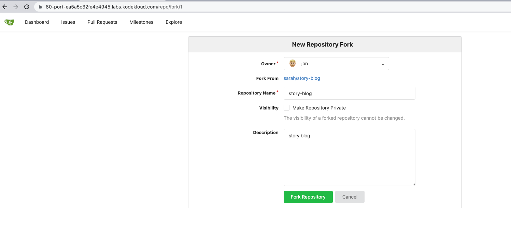

## Git Fork a Repository

### Problem

There is a Git server used by the Nautilus project teams. Recently a new developer Jon joined the team and needs to
start working on a project. To do so, he needs to fork an existing Git repository. Below you can find more details:

Click on the Gitea UI button on the top bar. You should be able to access the Gitea page.

Login to Gitea server using username jon and password Jon_pass123.

There you will see a Git repository sarah/story-blog, fork it under jon user.

Note: For these kind of scenarios requiring changes to be done in a web UI, please take screenshots so that you can
share it with us for review in case your task is marked incomplete. You may also consider using a screen recording
software such as loom.com to record and share your work.

CheckCompleteIncomplete

### Solution

