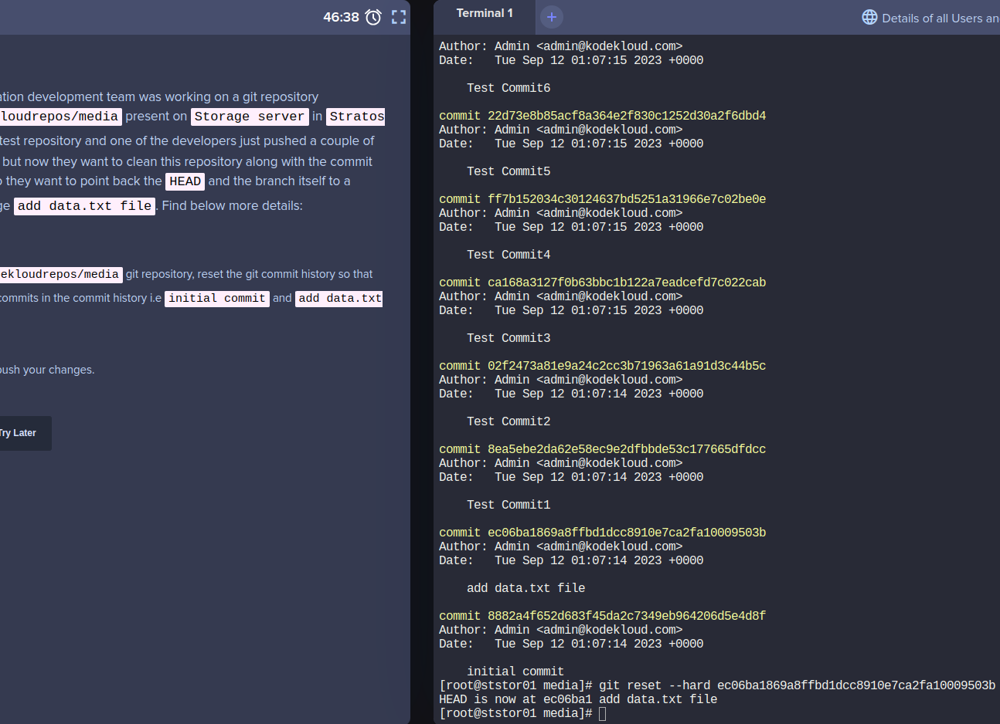

## Git hard reset

### Problem

The Nautilus application development team was working on a git repository /usr/src/kodekloudrepos/media present on
Storage server in Stratos DC. This was just a test repository and one of the developers just pushed a couple of changes
for testing, but now they want to clean this repository along with the commit history/work tree, so they want to point
back the HEAD and the branch itself to a commit with message add data.txt file. Find below more details:

In /usr/src/kodekloudrepos/media git repository, reset the git commit history so that there are only two commits in the
commit history i.e initial commit and add data.txt file.

Also make sure to push your changes.

### Solution

```shell
cd /usr/src/kodekloudrepos/media

git log

git reset --hard ec06ba1869a8ffbd1dcc8910e7ca2fa10009503b

git push origin master
```

