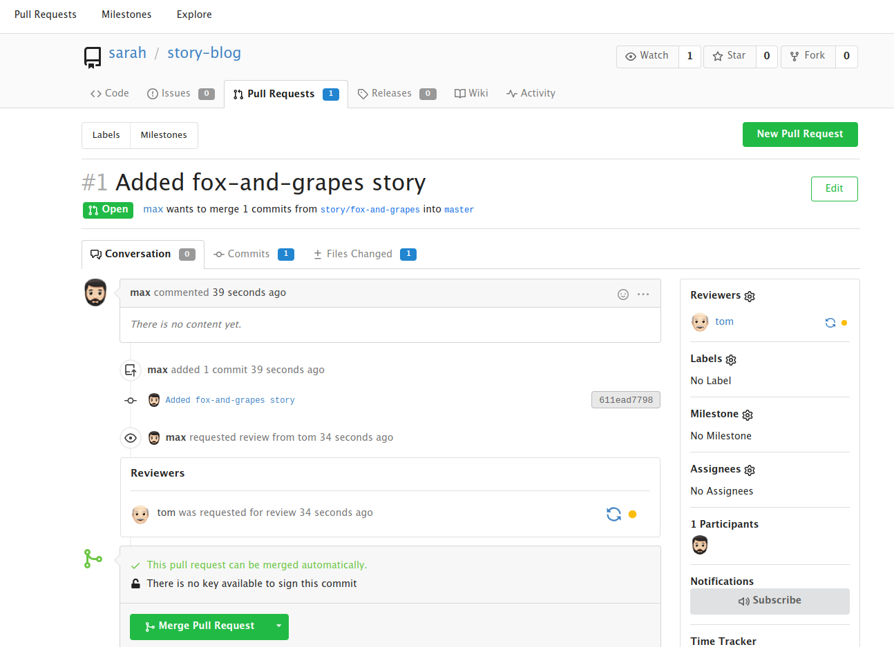
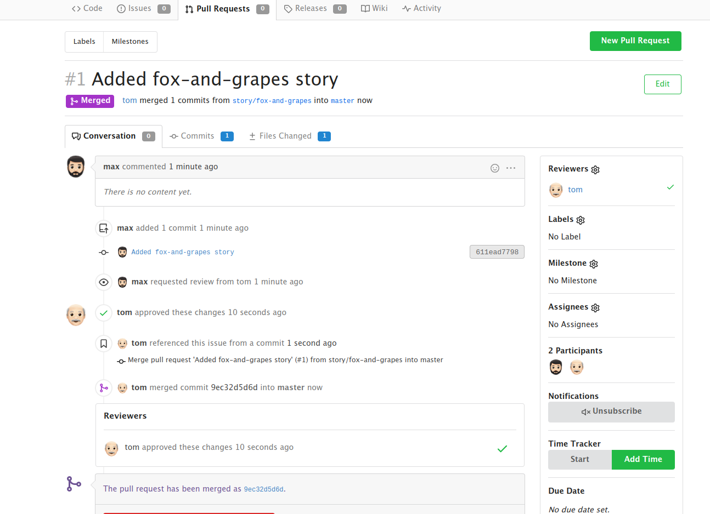

## Manage Git Pull Requests

### Problem

Max want to push some new changes to one of the repositories but we don't want people to push directly to master branch,
since that would be the final version of the code. It should always only have content that has been reviewed and
approved. We cannot just allow everyone to directly push to the master branch. So, let's do it the right way as
discussed below:

SSH into storage server using user max, password Max_pass123 . There you can find an already cloned repo under Max
user's home.

Max has written his story about The 🦊 Fox and Grapes 🍇

Max has already pushed his story to remote git repository hosted on Gitea branch story/fox-and-grapes

Check the contents of the cloned repository. Confirm that you can see Sarah's story and history of commits by running
git log and validate author info, commit message etc.

Max has pushed his story, but his story is still not in the master branch. Let's create a Pull Request(PR) to merge
Max's story/fox-and-grapes branch into the master branch

Click on the Gitea UI button on the top bar. You should be able to access the Gitea page.

UI login info:

- Username: max

- Password: Max_pass123

PR title : Added fox-and-grapes story

PR pull from branch: story/fox-and-grapes (source)

PR merge into branch: master (destination)

Before we can add our story to the master branch, it has to be reviewed. So, let's ask tom to review our PR by assigning
him as a reviewer

Add tom as reviewer through the Git Portal UI

Go to the newly created PR

Click on Reviewers on the right

Add tom as a reviewer to the PR

Now let's review and approve the PR as user Tom

Login to the portal with the user tom

Logout of Git Portal UI if logged in as max

UI login info:

- Username: tom

- Password: Tom_pass123

PR title : Added fox-and-grapes story

Review and merge it.

Great stuff!! The story has been merged! 👏

Note: For these kind of scenarios requiring changes to be done in a web UI, please take screenshots so that you can
share it with us for review in case your task is marked incomplete. You may also consider using a screen recording
software such as loom.com to record and share your work.

### Solution

```shell
sshpass -p Max_pass123 ssh -o StrictHostKeyChecking=no max@172.16.238.15
```



