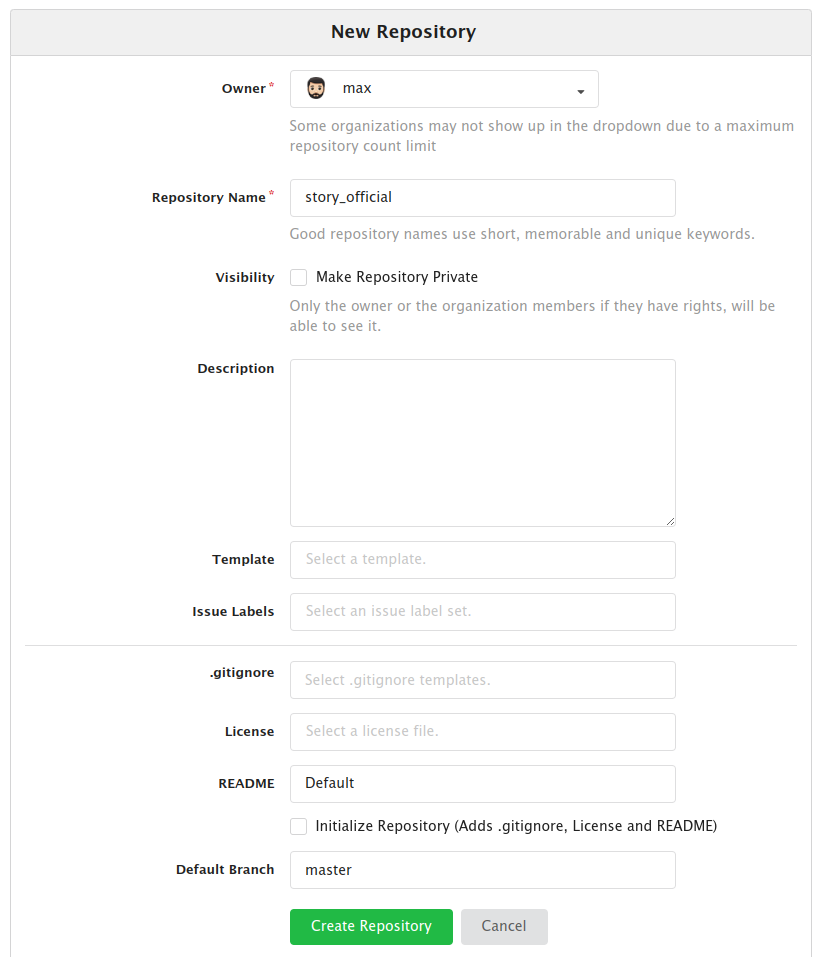
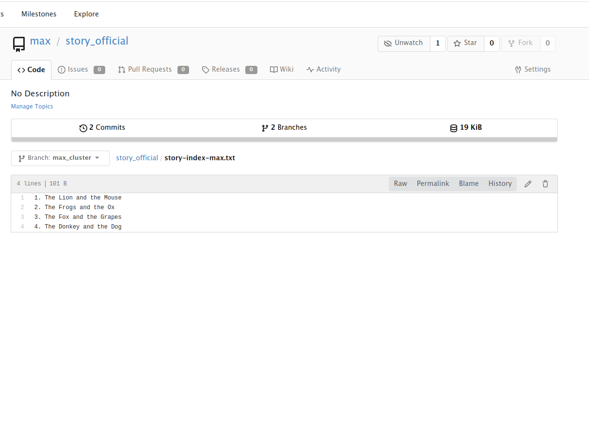

## Manage Git Repositories

### Problem

A new developer just joined the Nautilus development team and has been assigned a new project for which he needs to
create a new repository under his account on Gitea server. Additionally, there is some existing data that need to be
added to the repo. Below you can find more details about the task:

Click on the Gitea UI button on the top bar. You should be able to access the Gitea UI. Login to Gitea server using
username max and password Max_pass123.

a. Create a new git repository story_official under max user.

b. SSH into storage server using user max and password Max_pass123 and clone this newly created repository under user
max home directory i.e /home/max.

c. Copy all files from location /usr/devops to the repository and commit/push your changes to the master branch. The
commit message must be "add stories" (must be done in single commit).

d. Create a new branch max_cluster from master.

e. Copy a file story-index-max.txt from location /tmp/stories/ to the repository. This file has a typo, which you can
fix by changing the word Mooose to Mouse. Commit and push the changes to the newly created branch. Commit message must
be "typo fixed for Mooose" (must be done in single commit).

Note: For these kind of scenarios requiring changes to be done in a web UI, please take screenshots so that you can
share it with us for review in case your task is marked incomplete. You may also consider using a screen recording
software such as loom.com to record and share your work.

### Solution

- Access Gitea UI
- Create new repository:
  
- SSH into storage server using user max: `sshpass -p Max_pass123 ssh -o StrictHostKeyChecking=no max@ststor01`
- Clone newly created git repository: `git clone http://git.stratos.xfusioncorp.com/max/story_official.git`
- Copy all files from /usr/devops to /home/max: `cp /usr/devops/* story_official/`
- Commit changes:
```shell
git add .
git commit -m 'add stories'
git push origin master
```
- Create new branch max_cluster from master branch: `git checkout -b max_cluster master`
- Copy file: `cp /tmp/stories/story-index-max.txt .`
- Fix typo: `vi story-index-max.txt`
- Commit changes:
```shell
git add .
git commit -m 'typo fixed for Mooose'
git push origin max_cluster 
```
