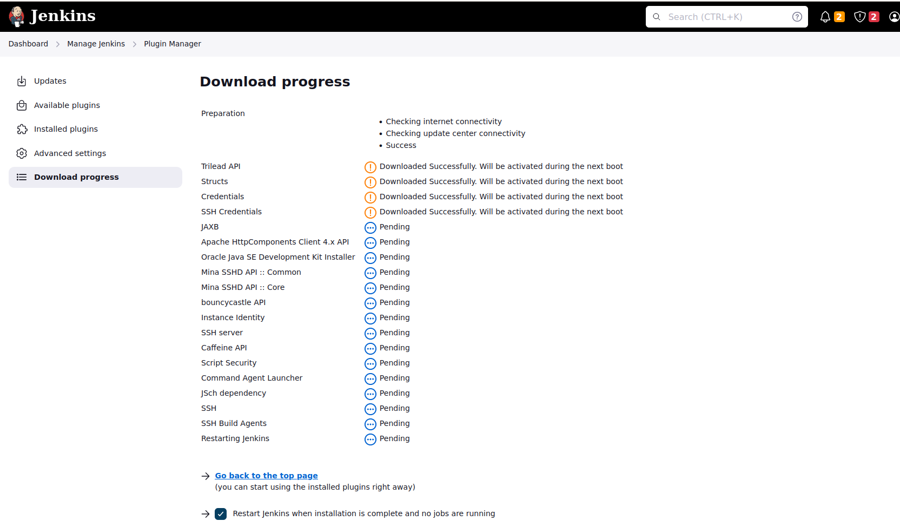
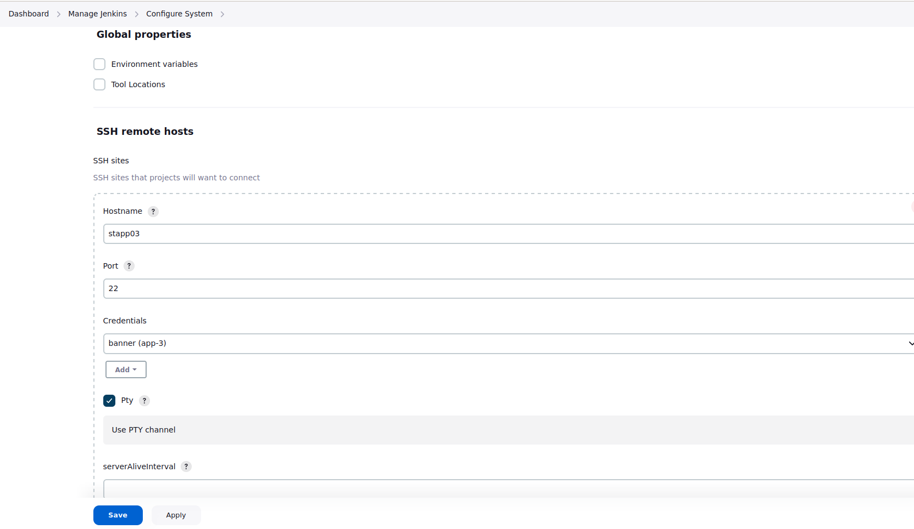
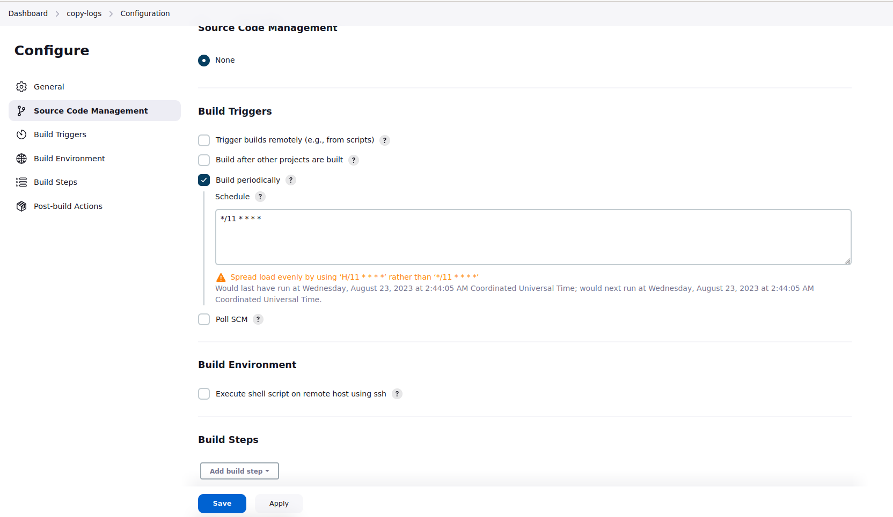

## Jenkins Scheduled Jobs

### Problem

The devops team of xFusionCorp Industries is working on to setup centralised logging management system to maintain and
analyse server logs easily. Since it will take some time to implement, they wanted to gather some server logs on a
regular basis. At least one of the app servers is having issues with the Apache server. The team needs Apache logs so
that they can identify and troubleshoot the issues easily if they arise. So they decided to create a Jenkins job to
collect logs from the server. Please create/configure a Jenkins job as per details mentioned below:

Click on the Jenkins button on the top bar to access the Jenkins UI. Login using username admin and password Adm!n321

1. Create a Jenkins jobs named copy-logs.

2. Configure it to periodically build every 11 minutes to copy the Apache logs (both access_log and error_logs) from App
   Server 3 (from default logs location) to location /usr/src/security on Storage Server.

Note:

1. You might need to install some plugins and restart Jenkins service. So, we recommend clicking on Restart Jenkins when
   installation is complete and no jobs are running on plugin installation/update page i.e update centre. Also, Jenkins
   UI sometimes gets stuck when Jenkins service restarts in the back end. In this case please make sure to refresh the
   UI page.

2. Please make sure to define you cron expression like this */10 * * * * (this is just an example to run job every 10
   minutes).

3. For these kind of scenarios requiring changes to be done in a web UI, please take screenshots so that you can share
   it with us for review in case your task is marked incomplete. You may also consider using a screen recording software
   such as loom.com to record and share your work.

### Solution

- Install Plugins: SSH, SSH Credentials
  

- Safe Restart Jenkins if install plugins restart not working: <jenkins-url>/safeRestart

- Manage Jenkins -> Credentials -> Add Credentials   
  
-
- Manage Jenkins -> Configure System -> Add remote hosts
  

- Job configuration:
- Dashboard -> copy-logs -> Configuration
    - Build periodically: Cronjob expression: */11 * * * *
      
- Build environment: Execute shell script on remote host using ssh

- Install sshpass on Nautilus App 3

```shell
  sshpass -p "Bl@kW" scp -p -o StrictHostKeyChecking=no /var/log/httpd/access_log natasha@ststor01:/usr/src/security
  sshpass -p "Bl@kW" scp -p -o StrictHostKeyChecking=no /var/log/httpd/error_log natasha@ststor01:/usr/src/security
```
    