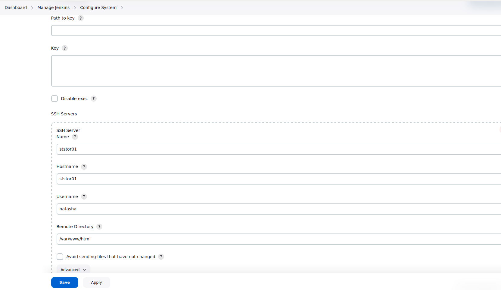
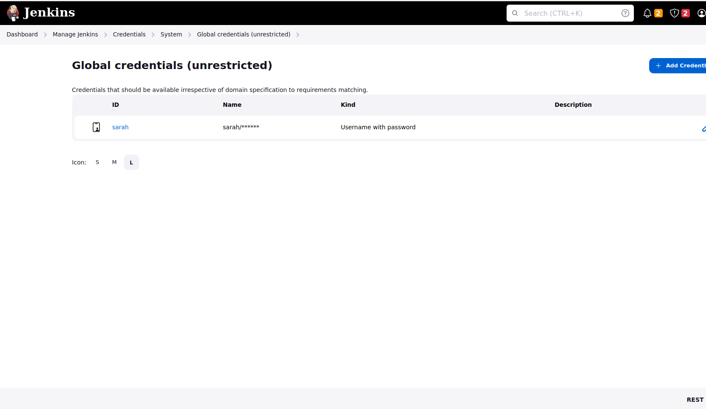
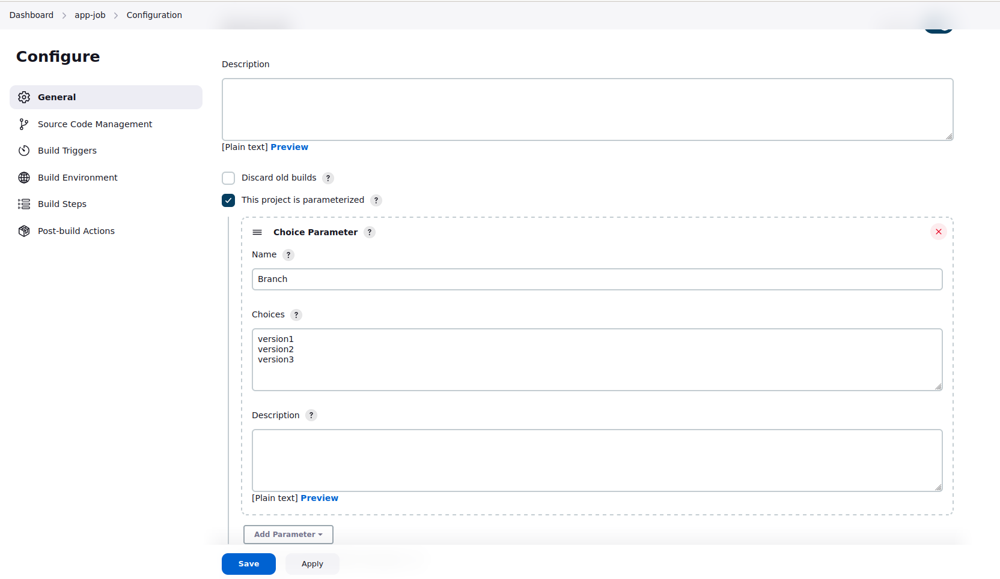
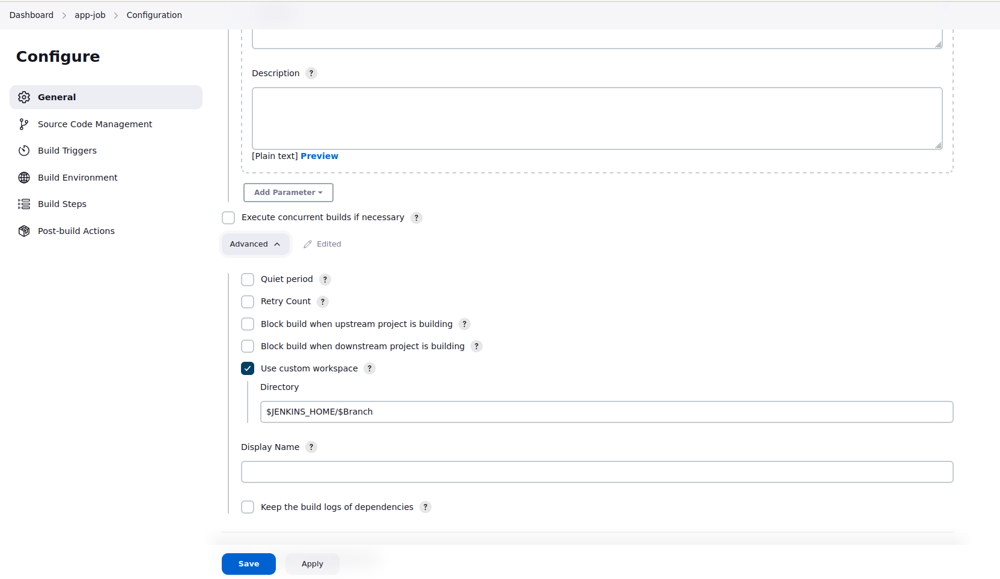
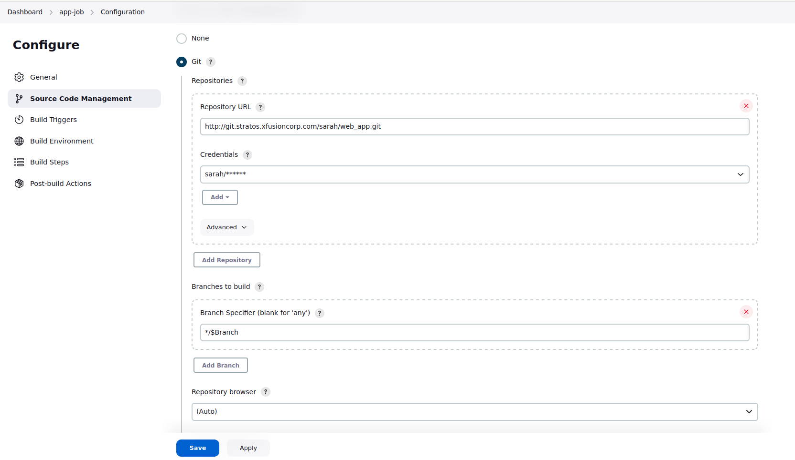

## Jenkins Workspaces 

### Problem

Some developers are working on a common repository where they are testing some features for an application. They are
having three branches (excluding the master branch) in this repository where they are adding changes related to these
different features. They want to test these changes on Stratos DC app servers so they need a Jenkins job using which
they can deploy these different branches as per requirements. Configure a Jenkins job accordingly.

Click on the Jenkins button on the top bar to access the Jenkins UI. Login using username admin and password Adm!n321.

Similarly, click on Gitea button to access the Gitea page. Login to Gitea server using username sarah and password
Sarah_pass123.

    There is a Git repository named web_app on Gitea where developers are pushing their changes. It has three branches version1, version2 and version3 (excluding the master branch). You need not to make any changes in the repository.

    Create a Jenkins job named app-job.

    Configure this job to have a choice parameter named Branch with choices as given below:

    version1

    version2

    version3

    Configure the job to fetch changes from above mentioned Git repository and make sure it should fetches the changes from the respective branch which you are passing as a choice in the choice parameter while building the job. For example if you choose version1 then it must fetch and deploy the changes from branch version1.

    Configure this job to use custom workspace rather than a default workspace and custom workspace directory should be created under /var/lib/jenkins (for example /var/lib/jenkins/version1) location rather than under any sub-directory etc. The job should use a workspace as per the value you will pass for Branch parameter while building the job. For example if you choose version1 while building the job then it should create a workspace directory called version1 and should fetch Git repository etc within that directory only.

    Configure the job to deploy code (fetched from Git repository) on storage server (in Stratos DC) under /var/www/html directory. Since its a shared volume.

    You can access the website by clicking on App button.

Note:

    You might need to install some plugins and restart Jenkins service. So, we recommend clicking on Restart Jenkins when installation is complete and no jobs are running on plugin installation/update page i.e update centre. Also, Jenkins UI sometimes gets stuck when Jenkins service restarts in the back end. In this case please make sure to refresh the UI page.

    For these kind of scenarios requiring changes to be done in a web UI, please take screenshots so that you can share it with us for review in case your task is marked incomplete. You may also consider using a screen recording software such as loom.com to record and share your work.

### Solution

- Install Jenkins plugins: Git, Publish over SSH 
  - Manage Jenkins -> Configure System -> Publish over SSH
    
  - Manage Jenkins -> Credentials -> System -> Global
    
- Configure job
  
- Configure custom workspace
  
- Configure Git
  
- Configure Send files over SSH
  