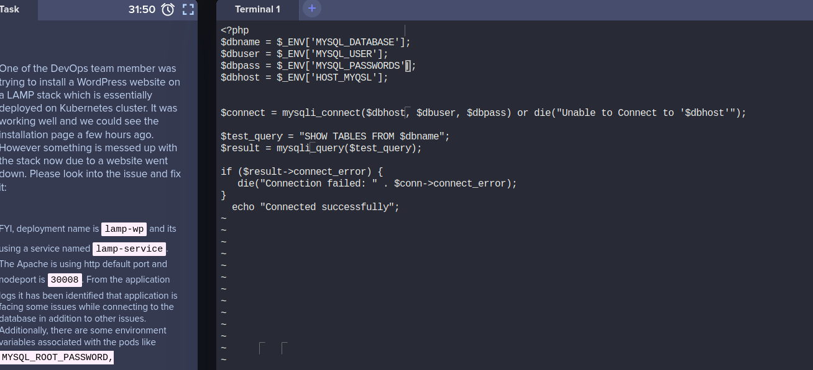

## Fix issue with LAMP Environment in Kubernetes

### Problem

One of the DevOps team member was trying to install a WordPress website on a LAMP stack which is essentially deployed on
Kubernetes cluster. It was working well and we could see the installation page a few hours ago. However something is
messed up with the stack now due to a website went down. Please look into the issue and fix it:

FYI, deployment name is lamp-wp and its using a service named lamp-service. The Apache is using http default port and
nodeport is 30008. From the application logs it has been identified that application is facing some issues while
connecting to the database in addition to other issues. Additionally, there are some environment variables associated
with the pods like MYSQL_ROOT_PASSWORD, MYSQL_DATABASE, MYSQL_USER, MYSQL_PASSWORD, MYSQL_HOST.

Also do not try to delete/modify any other existing components like deployment name, service name, types, labels etc.

Note: The kubectl utility on jump_host has been configured to work with the kubernetes cluster.

### Solution

```shell
pod: lamp-wp-56c7c454fc-8bwt8
containers: httpd-php-container, mysql-container

MYSQL_ROOT_PASSWORD=R00t
MYSQL_DATABASE=kodekloud_db2
MYSQL_USER=kodekloud_gem
MYSQL_PASSWORD=Rc5C9EyvbU
MYSQL_HOST=mysql-service

kubectl patch svc/lamp-service --type='json' -p '[{"op":"replace", "path":"/spec/ports/0/nodePort", "value":30008}]'
```

```shell
kubectl exec --stdin --tty lamp-wp-56c7c454fc-8bwt8 -c httpd-php-container -- /bin/bash
vi /var/www/html
```



```shell
Change MYSQL_PASSWORDS -> MYSQL_PASSWORD
Change HOST_MYSQL -> MYSQL_HOST
service apache2 restart
```
